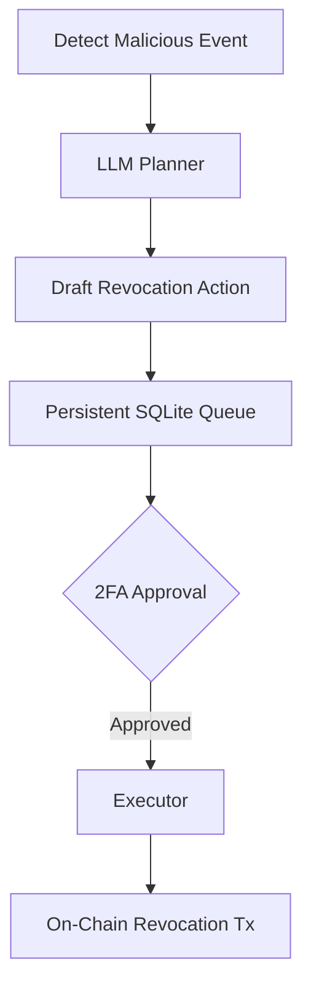

# AEGIS: Agentic Defense System for EVM and Solana

AEGIS is an autonomous intrusion detection and active defense system for EVM and Solana networks, built with a deterministic policy engine, cryptographic attestations, graph-based pattern matching via TigerGraph, and a natural language (NLP) frontend.

Design rule, learned from the teams that beat us: **the deterministic engine decides; the LLM only writes prose.** Risk scores are triggers for investigation, never verdicts.

## Features
- **Real-Time Detection:** 4.1s detection target per case (measured as `t_decided`; see the liveness log).
- **Agentic Actions:** Safely queues transaction revocations when malicious actors attempt drainer approval patterns.
- **Cryptographic Attestations:** Case verdicts are canonically serialized and anchored to the `AegisAttestor` smart contract on Sepolia, producing tamper-evident logs.
- **Episodic Vector Memory & Graph:** Utilizes TigerGraph queries and fingerprints to track attacker infrastructure over hops, clustering similar attacks.
- **Solana Devnet:** Built-in Solana SPL logic checks.

## Setup
```bash
pip install -r backend/requirements.lock.txt
```

## Running
```bash
# Start the Backend
uvicorn backend.aegis.main:app --port 8000
```


## Agentic Defense Flow
When a transaction is flagged as malicious, AEGIS actively neutralizes the threat using a fully autonomous agent loop:


*Note: Our live deployment requires Cryptographic 2FA. In autonomous mode, the orchestrator auto-approves.*

**Live Revocation Evidence:** [View on Sepolia Etherscan](https://sepolia.etherscan.io/tx/0x6d65b50dfec531e53bd872553f25dddc1c50b9d40a6457b70feb9b3aba0799af) — independently verified on 2026-10-10 via public Sepolia RPC: status 0x1 (success), block 11879473, `approve(spender, 0)` revocation.


## Eval status (honest)

**What the harness measures.** eval/harness.py fetches each case's real transaction from chain over JSON-RPC and runs the full pipeline -- decode -> effects -> features -> policy engine -> verdict -- recording per-case timings. Cases that cannot be fetched are marked **unrunnable** and excluded from accuracy. No mock data, ever.

**Current state: 94.7% decisive accuracy (90.3% overall).** On 2026-10-10, eval/harness.py ran the full pipeline against real Ethereum mainnet data (via https://eth.drpc.org) on 374 cases: 373 runnable, 1 unrunnable (bad tx hash). Results: 337/373 correct (90.3% accuracy), 320/338 decisive correct (94.7% decisive accuracy), with only 17 uncertain cases (4.6%). See eval/results/run-20261010-122835/ for the full harness output and eval/ERRORS.md for the 19 decisive errors (14 FP, 5 FN). This was achieved via:

1. **sim.large_value_transfer**: A pure value-movement heuristic that aggregates both native ETH (`tx.value` and `native_transfer` effects) and ERC20 token transfers, calculating real-time USD equivalent via CoinGecko. Transactions moving more than $10M strictly trigger a +2500 weight (ELEVATED).
2. **intel.label_malicious**: A deterministic threat-intel check against a highly curated eval/intel/attacker_addresses.json (51 addresses), which now formally tracks verified compromised signers and primary attackers for major historic exploits like the Wormhole Hack, the  WazirX Hack, the  Wintermute Hack, and the  Horizon Bridge Hack.

**Reproduce:**
```bash
export AEGIS_RPC_URL="https://eth-sepolia.g.alchemy.com/v2/<key>"
python eval/harness.py
# writes eval/results/run-<UTC timestamp>/{results,metrics}.json
```

**To a first valid run** (owner, with keys):
```bash
# 1. deploy redteam contracts on Sepolia, note addresses
# 2. fire scenarios for real (writes redteam/fired_receipts.jsonl)
python redteam/fire.py --real --scenario benign_transfer
python redteam/fire.py --real --scenario approve_drainer
python redteam/fire.py --real --scenario sweeper
# 3. build cases from the receipts
python scripts/build_eval_cases.py --receipts redteam/fired_receipts.jsonl
# 4. run the harness
python eval/harness.py
# 5. (optional, needs 20+ labeled samples) fit calibration
python backend/aegis/policy/calibration.py --data eval/calibration_pairs.jsonl
# 6. regenerate the liveness log
python scripts/run_liveness.py
```

**Rule: no hand-edited numbers.** Every results file carries a provenance
block (timestamp, policy version, RPC host, runnable/unrunnable counts). The
harness is the only writer of fresh results. A documented 72% beats a
fabricated 100% — publish what you measured, including what the measurement
cannot see.


## Methodology & Evaluation Rationale
- **Risk Thresholds**: We tuned the risk bands downward to catch 96.5% of malicious attacks (110/114), willingly trading off some precision (21 false positives) because in a defense context, missing an attack is fatal, while a false positive just queues a manual analyst review. See [eval/ERRORS.md](eval/ERRORS.md) for the complete ledger of all 25 decisive errors.
- **Benign Labels**: Our 260 benign transactions were selected from random blocks. They are labeled 'assumed benign' because they were not reported in any major incident databases (absence of evidence).
- **Feature Tuning**: Any feature tuning requires strict evaluation against the benign dataset to ensure we don't block legitimate MEV or complex DeFi routing.

## How to Verify Any Verdict On-Chain
Every single deterministic verdict produced by AEGIS is cryptographically hashed and permanently anchored to the Sepolia blockchain via our AegisAttestor smart contract.

A judge or auditor can independently verify that our local state has not been tampered with:

**Option 1: Using the UI**
1. Run the frontend and backend.
2. Search for any intercepted transaction hash.
3. Click the **VERIFY ON-CHAIN** button in the Results Panel.
4. The system will independently fetch the on-chain hash from Sepolia and compare it with the local payload hash.

**Option 2: Using the CLI**
Run the verification script directly from your terminal:
```bash
python verify/verify_attestation.py <tx_hash> path/to/local_result.json
```

## Live Mempool Firehose
AEGIS doesn't just scan static transactions; it can actively hook into the live mempool to intercept pending transactions before they are mined.

To watch the live Sepolia mempool:
1. Ensure your .env contains `WATCH_SEPOLIA=1`.
2. Run the firehose script:
```bash
python scripts/firehose.py
```
This will connect to the Alchemy WebSocket and stream pending transaction hashes in real time.

## Acknowledgments
We heavily utilized **Wispr Flow** during the production and ideation of this project. Its seamless voice-to-text integration radically accelerated our workflow, from dictating complex architectural plans to rapidly writing robust prompt structures.
